<div align="center">

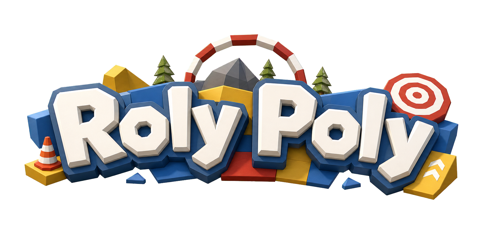

# Roly-Poly

**물리 기반 멀티플레이 캐주얼 파티 게임**

Unity Netcode와 Express API 서버 기반의 실시간 물리 동기화 및 로비 시스템 구현

2026 동양미래대학교 졸업작품 · Team GreenCamp

<br/>


</div>

---

## 🎮 게임 영상

[](https://youtu.be/5tO9JZlhTJI)

> 위 썸네일을 클릭하면 유튜브에서 플레이 영상을 볼 수 있습니다. ▶️ https://youtu.be/5tO9JZlhTJI

## 소개

**Roly-Poly**는 오뚝이처럼 휘청거리는 캐릭터를 조작해 동료들과 함께 장애물 코스를 통과하는 **물리 기반 멀티플레이 캐주얼 파티 게임**입니다. *Gang Beasts*, *Human Fall Flat* 처럼 예측 불가능한 물리 시뮬레이션 자체가 핵심 재미가 됩니다.

- **예측 불가능한 물리 시스템** — 무게 중심이 하단에 쏠린 오뚝이 캐릭터로, 넘어질 듯 넘어지지 않는 아슬아슬한 긴장감과 의외성
- **직관적인 로우폴리 비주얼** — 단순하지만 명확한 그래픽으로 기믹과 장애물을 한눈에 파악
- **실시간 물리 상호작용** — 플레이어 간 충돌과 지형·기믹과의 물리적 결합으로 매 판마다 새로운 상황 연출

## 게임 플레이 핵심 루프

```
캐릭터 조작  →  월드 상호작용  →  협력 플레이  →  다음 라운드 진행
 (물리 이동)     (기믹·장애물)     (목표 지점 도달)    (스테이지 전환)
```

플레이어는 물리 엔진 기반 캐릭터를 조작해 월드를 탐험하고, 맵 곳곳의 장애물·기믹·아이템과 상호작용하며 동료와 협력해 목표 지점에 도달합니다.

## 시스템 아키텍처

| 레이어 | 역할 |
|--------|------|
| **Client** (Unity) | Rigidbody 기반 물리 연산, 플레이어 입력 처리, UI 및 연출 |
| **Backend** (Express) | 게임 방 생성/관리, 참가자 검증, REST API 서비스 |
| **Database** (MySQL) | 방 목록, 접속 IP, 맵 정보 등 세션 메타데이터 영속성 관리 |
| **Networking Layer** | Unity Netcode — Relay(Host-Client) 방식의 실시간 물리 상태 동기화 |

## 주요 기능

### 물리 기반 캐릭터 제어
- **균형 시스템** — 무게 중심을 하단으로 설정(`centerOfMassOffset`)해 안정성을 확보하고, 쓰러졌을 때 `uprightTorque`를 실시간 계산해 자가 복구
- **정밀 지면·마찰 제어** — Sphere Cast로 경사면 미끄러짐과 접지 상태를 판정하고, 정지/이동에 따라 마찰력을 유동적으로 제어
- **컴포넌트 기반 액션** — 모든 특수 액션을 힘(Force)·토크(Torque) 기반 독립 컴포넌트로 설계
  - `PlayerInteractor` — Raycast 기반 상호작용 및 아웃라인 하이라이팅
  - `PlayerMount` — 특정 오브젝트 탑승 및 조작 제어
  - `PlayerClimb` — 벽면 접촉 지점 계산과 중력 벡터 수정을 통한 기어오르기

### 환경 상호작용 & 물리 퍼즐
- **직접 동작 트리거** — 일정 시간 ON 되는 버튼, 상태 전환 레버(ON/OFF)
- **아이템 연동 시스템** — 집어 들 수 있는 물리 오브젝트, 영역 거치/입력 감지(SnapZone·TriggerSocket), 논리 연동 개폐 문
- **물리·타이밍 발판** — 밟으면 일정 시간 후 낙하/소멸하는 발판, 정해진 경로를 왕복하는 이동 발판
- 모든 조작 가능한 오브젝트는 `IInteractable` 인터페이스를 상속해 일관된 상호작용 로직을 공유하며, 멀티플레이 환경에서 기믹 상태가 실시간 동기화됨

### 실시간 네트워크 동기화
- **서버 권한 모델(Server Authority)** — 모든 중요 판정과 위치 보정은 서버(호스트)가 주도해 핵 방지 및 전 플레이어 동일 물리 상태 보장
- **실시간 상태 동기화** — Network Variable 및 Hook으로 UI·캐릭터 상태를 동기화, 로컬 입력은 즉시 반영해 반응성 확보
- **지연 보정** — Rigidbody Interpolation으로 패킷 지연·손실 시에도 움직임을 부드럽게 유지

### 로비 & 방 매칭 (REST API)

| Method | Endpoint | 설명 |
|--------|----------|------|
| `GET` | `/rooms` | 활성화된 공개 게임 방 목록 실시간 조회 |
| `POST` | `/rooms` | 신규 세션 등록 및 호스트 접속 정보 저장 |
| `POST` | `/rooms/:id/join` | 방 입장 시 정원 확인 및 세션 데이터 갱신 |
| `POST` | `/rooms/:id/leave` | 퇴장 처리 및 빈 방 자동 삭제 |
| `PATCH` | `/rooms/:id` | 방 정보 수정 |

> REST 기반의 유연한 스키마 설계로 Local IP 접속부터 Unity Relay Service 대응까지 가능하며, 대규모 배포 환경으로의 확장이 용이합니다.

### UI/UX
- Unity UI(UGUI) 기반 반응형 레이아웃, 해상도 대응 Anchor·Canvas Scaler 최적화
- 런타임 동적 방 목록 프리팹 바인딩(Scroll Rect + Vertical Layout Group)
- Title ↔ Lobby ↔ Game 간 매끄러운 화면 전환

## 기술 스택

| 구분 | 사용 기술 |
|------|-----------|
| 게임 엔진 | Unity 6 (6000.3.10f1) |
| 언어 | C# |
| 네트워킹 | Netcode for GameObjects, Unity Multiplayer Services (Relay) |
| 그래픽 | URP, Cinemachine, Animation Rigging |
| 입력 | Unity Input System |
| 백엔드 | Node.js, Express, MySQL |

## 조작법

| 동작 | 키 |
|------|----|
| 이동 | `W` `A` `S` `D` |
| 점프 | `Space` |
| 달리기 | `Shift` |
| 상호작용 / 잡기 | `E` |
| 시점 회전 | 마우스 |

> 실제 키 매핑은 `Assets/InputSystem_Actions.inputactions` 기준이며 인게임 설정에서 변경할 수 있습니다.

## 프로젝트 구조

```
Battle-Royal/
├── Assets/
│   ├── Scripts/
│   │   ├── Player/         # 캐릭터 물리·균형·충격·등반·탑승·상호작용
│   │   ├── Network/        # 세션 매니저, 방 API 클라이언트
│   │   ├── Gameplay/       # 체크포인트, 리스폰, 클리어 트리거
│   │   ├── Interactable/   # 레버·버튼·발판·문·차량 등 기믹 (IInteractable)
│   │   └── *UIController   # 타이틀 / 로비 UI
│   ├── Scenes/             # Title, Lobby, Stage 1, City Stage 등
│   ├── Prefab/ · UI/ · Animations/ · Resources/
│   └── logo.png
├── backend/               # Node.js + Express + MySQL 방 서버
├── docs/slides/           # 프로젝트 발표 자료 슬라이드
├── Packages/              # Unity 패키지 매니페스트
└── ProjectSettings/
```

## 개발 현황

- ✅ **핵심 물리 메커니즘 구현 완료** — Rigidbody 기반 이동, 오뚝이 균형(Balance), 벽 타기(Climb) 등 기본 조작계 구축
- ✅ **네트워크 동기화 기반 마련** — Unity Netcode 기반 실시간 위치·동작 동기화 테스트 완료
- ✅ **로컬 백엔드 매칭 시스템 검증** — Node.js Express + MySQL 기반 로컬 방 개설·입장 REST API 연동 완료

## 향후 계획

1. **Polishing** — 물리 컨트롤러 세부 조정, 정교한 캐릭터 애니메이션 연동, 카메라 연출·타격감 보강
2. **Cloud & Scaling** — AWS EC2·RDS 클라우드 인프라 이전, 실시간 퍼블릭 멀티플레이 환경 구축, 대규모 접속 스트레스 테스트
3. **Content Expansion** — 다양한 맵 기믹·장애물 시스템, 보상 시스템, 대기실 ↔ 게임 루프 세션 자동화

## 발표 자료

<div align="center">

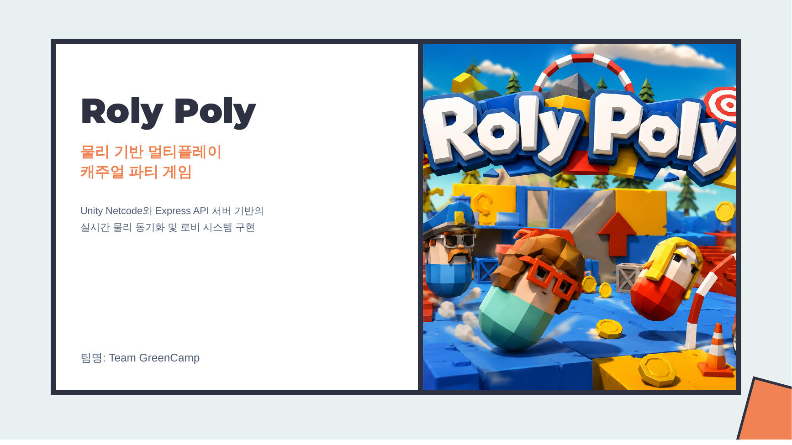
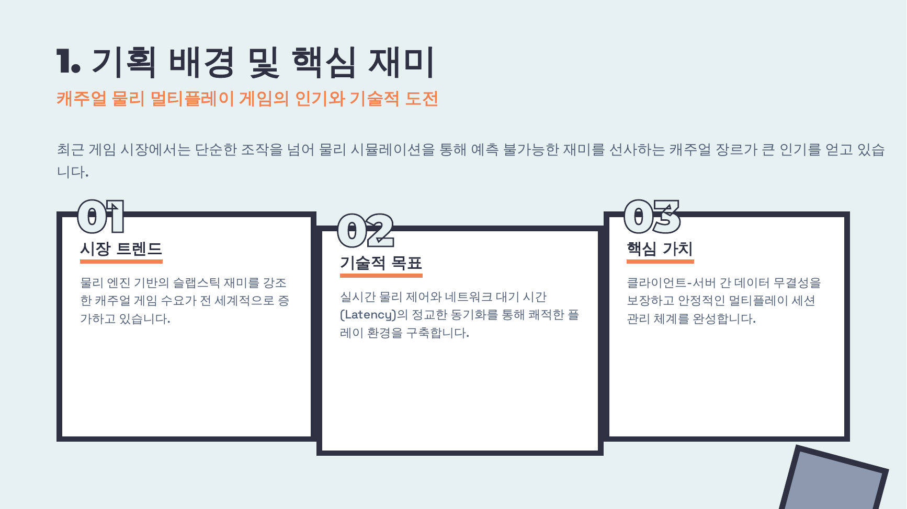
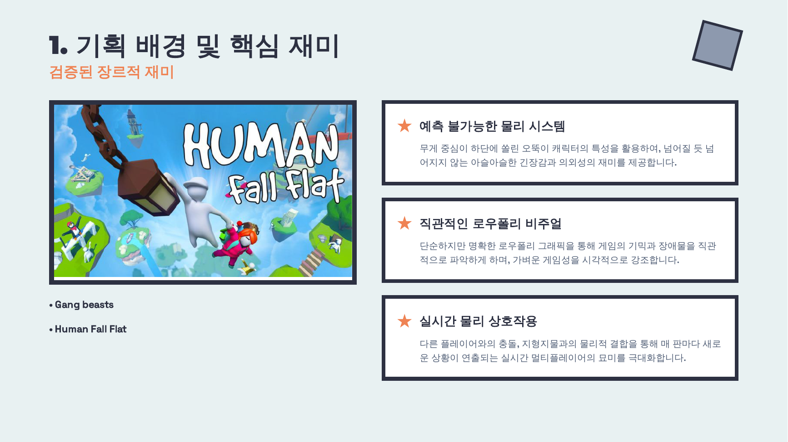
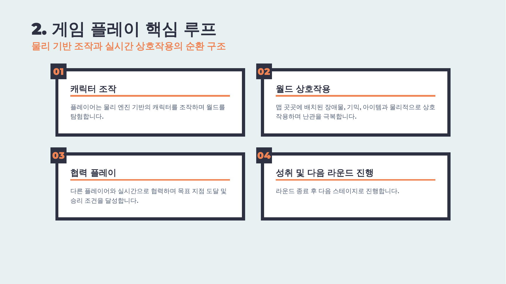
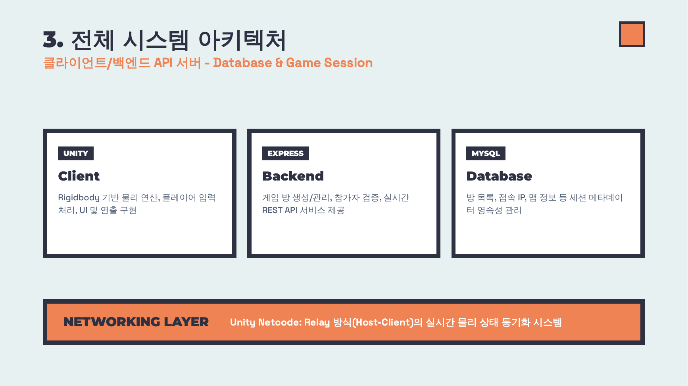
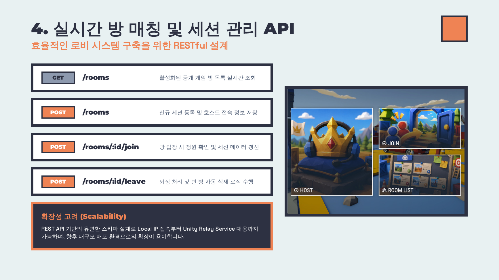
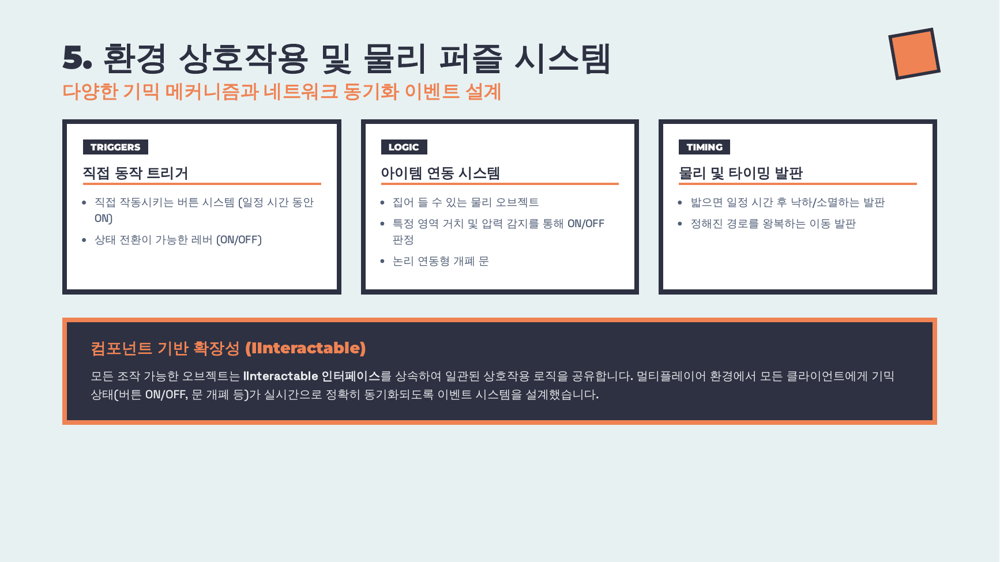
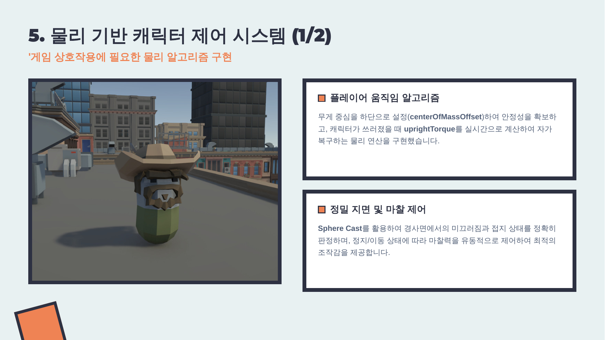
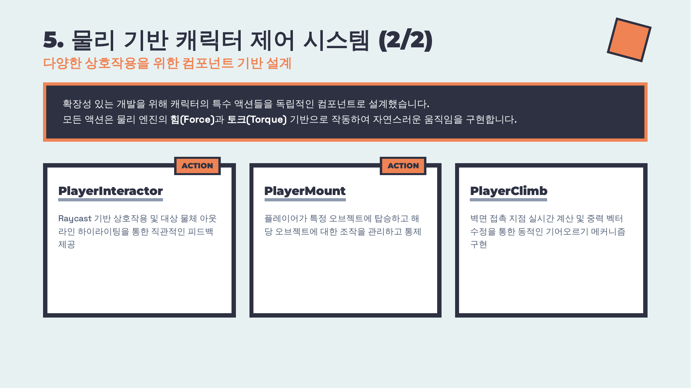
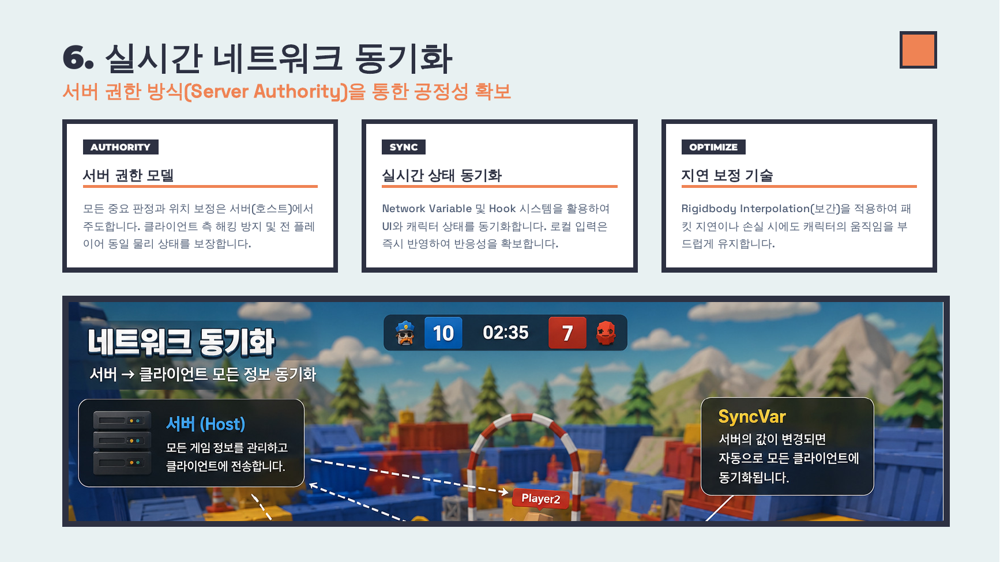
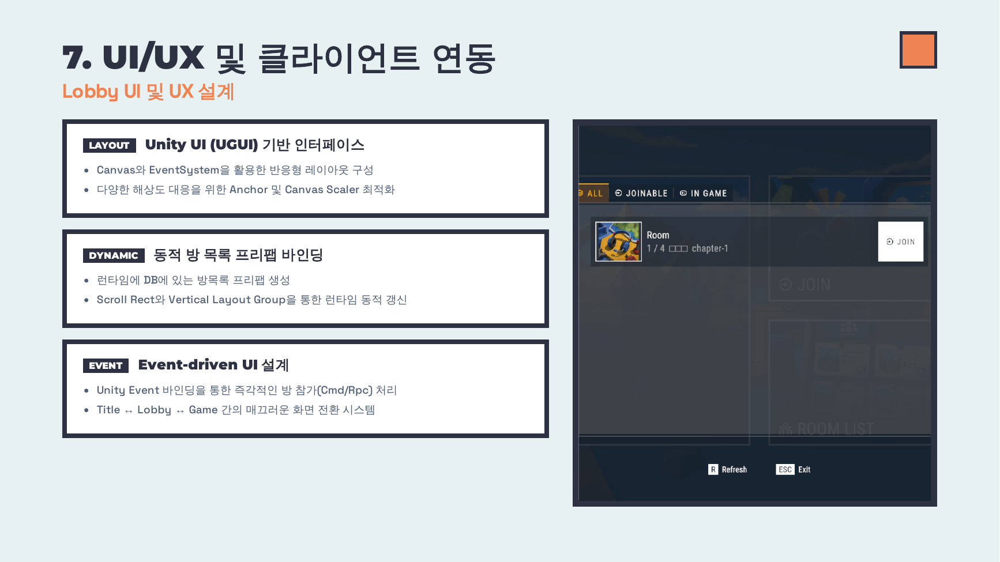
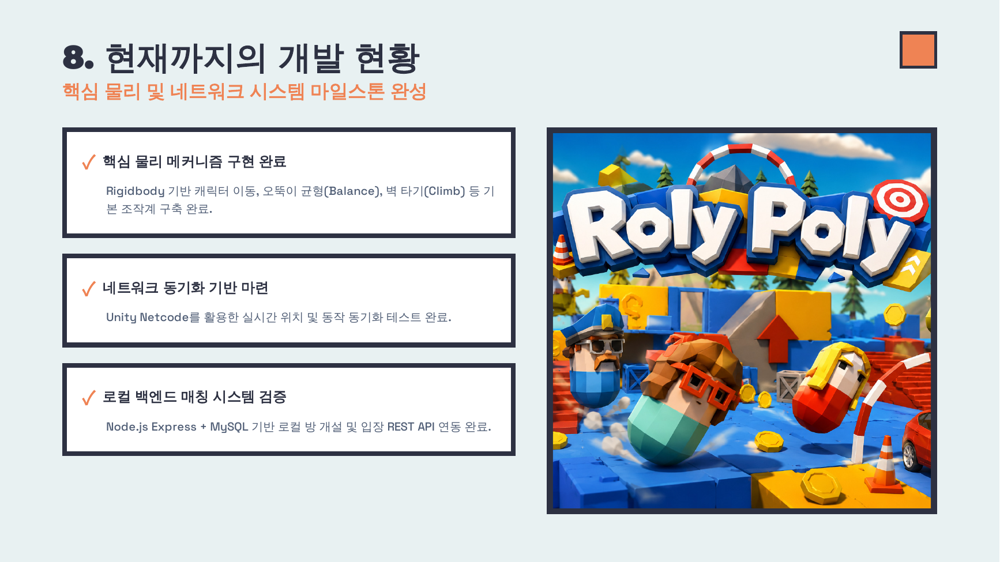
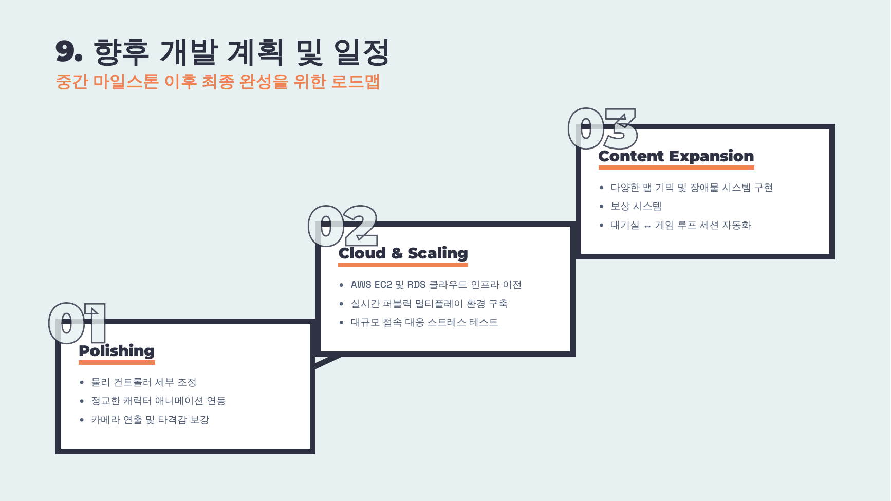

</div>

## 팀

**Team GreenCamp**

| 이름 | 역할 |
|------|------|
| 송신화 | PM · 개발 |
| 전우영 | 개발 |

---

<div align="center">

2026 동양미래대학교 졸업작품 · Team GreenCamp

</div>
